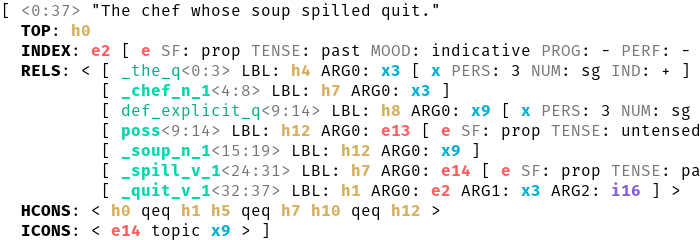
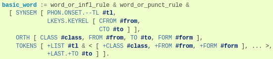

# Archive Notice

The delphin-latex plugin has been bundled into [PyDelphin](https://github.com/delph-in/pydelphin/) as of version 1.7.0. This repository will now be archived and further development should happen in PyDelphin.

> # delphin.highlight
>
> This module provides the following [Pygments][]
> [lexers](http://pygments.org/lexers):
>
> * `delphin.highlight.TDLLexer` -- For [Type Description Language][TDL] (TDL)
> * `delphin.highlight.SimpleMRSLexer` -- For [SimpleMRS][], a popular
>   serialization format for Minimal Recursion Semantics
>
> In addition, the following Pygments
> [style](http://pygments.org/docs/styles/) is included:
>
> * `delphin.highlight.MRSStyle` -- Draws attention to interesting
>   information in SimpleMRS
>
> # Examples
>
> The SimpleMRS style is meant for console output, and works with both
> dark and light backgrounds:
>
> 
>
> 
>
> The TDL lexer is used for [PyDelphin][]'s [Sphinx][]-based documentation:
>
> 
>
>
> # Installation and Requirements
>
> This module is a [namespace package][] of [PyDelphin][], but it does
> not depend on any PyDelphin packages, rather it only depends on
> Pygments version 2.3.1 or higher. This means it can be used
> independently of PyDelphin.
>
> This module can be installed via `pip`:
>
> ``` console
> $ pip install delphin.highlight
> ```
>
> Note, however, that it will likely not work correctly if installed to
> the same environment as a PyDelphin version less than 1.0.0 because of
> how namespace packages work. But in this case it is already included
> in those versions as `delphin.extra.highlight`.
>
> [namespace package]: https://docs.python.org/3/reference/import.html#namespace-packages
>
> # Usage
>
> While you can drop in the lexers into Pygments-capable applications
> like wikis or documentation sites, the console highlighting of
> SimpleMRS is provided by the [PyDelphin][] package via the `delphin
> convert` command. For instance, the example in the screenshot above
> could be created with a command like the following:
>
> ```console
> $ echo "The chef whose soup spilled quit." \
> > | ace -g ~/grammars/erg-2018-x86-64-0.9.30.dat -1 \
> > | delphin convert --from ace --color=always --indent
> ```
>
>
> [DELPH-IN]: http://www.delph-in.net
> [Pygments]: http://pygments.org
> [PyDelphin]: https://github.com/delph-in/pydelphin
> [SimpleMRS]: http://moin.delph-in.net/MrsRfc
> [Sphinx]: http://www.sphinx-doc.org/
> [TDL]: http://moin.delph-in.net/TdlRfc
