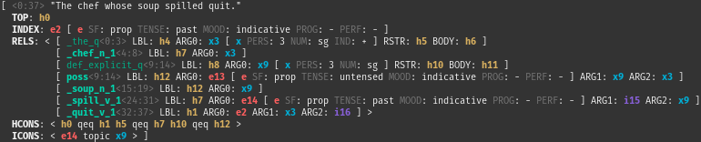
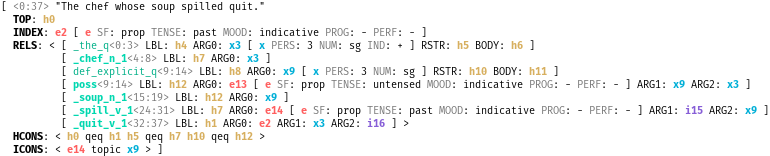

# delphin.highlight

This module provides [Pygments][] [lexers](http://pygments.org/lexers)
for the following [DELPH-IN][] formats:

* [TDL][] -- Type Description Language
* [SimpleMRS][] -- A popular serialization format for Minimal
  Recursion Semantics

In addition, a Pygments [style](http://pygments.org/docs/styles/) for
MRS is available which helps highlight the interesting information in
SimpleMRS. It is meant for console output, and works with both dark
and light backgrounds:

The TDL lexer is used for [PyDelphin][]'s [Sphinx][]-based documentation:

# Installation and Requirements

This module only depends on Pygments version 2.3.1 or higher. The
console highlighting is provided by the [PyDelphin][] package.

[DELPH-IN]: http://www.delph-in.net
[Pygments]: http://pygments.org
[PyDelphin]: https://github.com/delph-in/pydelphin
[SimpleMRS]: http://moin.delph-in.net/MrsRfc
[Sphinx]: http://www.sphinx-doc.org/
[TDL]: http://moin.delph-in.net/TdlRfc
